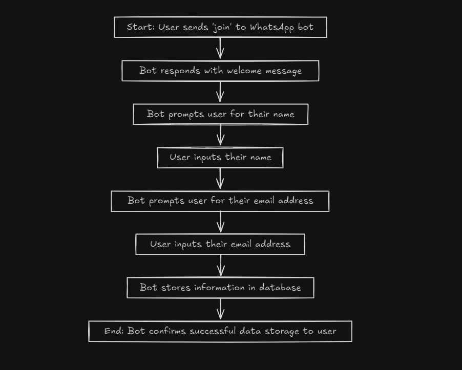

# WhatsApp Bot Workflow

## Overview

This document outlines the workflow for the WhatsApp bot built using Flask and WATI. The bot interacts with users by sending messages and collecting information.

## Workflow Steps

1. **Start**: User sends 'join' to WhatsApp bot.
2. **Welcome Message**: Bot responds with a welcome message.
3. **Name Prompt**: Bot prompts the user for their name.
4. **User Inputs Name**: User provides their name.
5. **Email Prompt**: Bot prompts the user for their email address.
6. **User Inputs Email**: User provides their email address.
7. **Data Storage**: Bot stores the information in a database.
8. **End**: Bot confirms successful data storage to the user.

## Diagram

Here’s a visual representation of the workflow:

## Conclusion

This workflow ensures a smooth interaction between the user and the WhatsApp bot, allowing for efficient data collection and confirmation.

